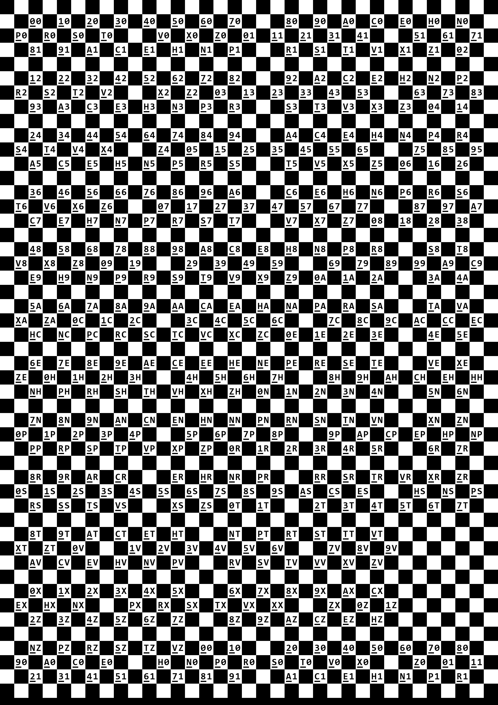
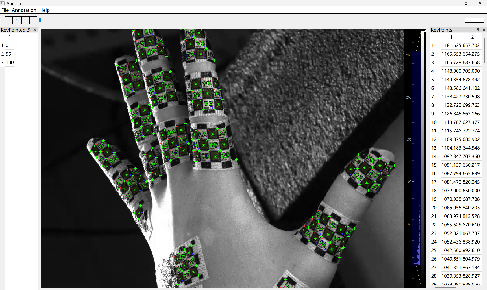
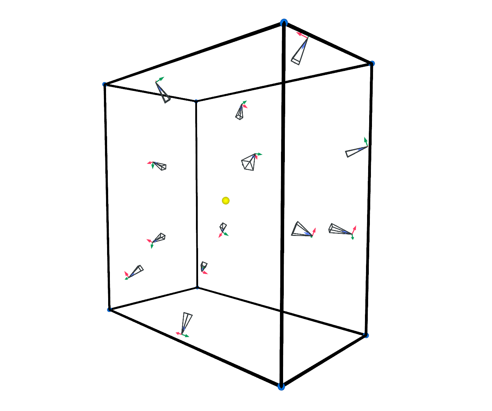

# Mocap System


## Directory Structure

```
MocapSystem/
├── annotateKeyPoints.py      # Keypoint annotation tool (PyQt5 GUI)
├── calibrate_intrinsic.py    # Camera intrinsic calibration
├── calibrate_extrinsic.py    # Camera extrinsic calibration
├── pattern_gen.py            # Marker pattern generator
├── showCam.py                # Camera position visualization
├── visualize.py              # 3D data visualization (Rerun)
└── utils.py                  # Utility function library
```

## Main Features

### 1. Marker Pattern Generation (`pattern_gen.py`)

Generates marker patterns for motion capture, supporting various characters, font and layouts.  
Need to download CONSOLAB.TTF first.  

<p align="center"></p>

### 2. Camera Calibration

#### Intrinsic Calibration (`calibrate_intrinsic.py`)

Performs intrinsic calibration using a chessboard pattern video to compute the camera intrinsic matrix and distortion coefficients.

Input:
- Each camera should record its own video capturing the calibration board. In each video, the calibration board should be moved repeatedly and should cover as much of the image area as possible. 

**Usage:**
```bash
python calibrate_intrinsic.py \
    -v <video_path> \
    --chessboard_size (8,11) \
    --chessboard_edge_length <edge_length_in_meters> \
    -o <output_file.npz> \
    [--save-check-image]
```


#### Extrinsic Calibration (`calibrate_extrinsic.py`)

Calibrates the extrinsic parameters (relative positions and orientations) of a multi-camera system.

Input:
- Several photos: Each camera (not necessarily all) takes a photo of a fixed calibration board at different positions. 
- Videos: All cameras simultaneously record synchronized videos while the calibration board is moved around within the scene.

**Usage:**
```bash
python calibrate_extrinsic.py  \
    --camera-ids 1,2,3,...
    --chessboard_size (8,11) \
    --chessboard_edge_length <edge_length_in_meters> \
    -o <output_dir> \
    --intrinsic-folder <params_folder> \
    --intrinsic-fn-fmt <intrinsic_file_format> 
```  

For detailed usage, please refer to the code.


### 3. Keypoint Annotation (`annotateKeyPoints.py`)

<p align="center"></p>

An interactive keypoint annotation tool based on PyQt5.

Supports selecting frames from videos and efficiently annotating both point and block information, saving the results as JSON files. Additionally, it supports rapid annotation by leveraging existing models.


**Usage:**
```bash
python annotateKeyPoints.py
```


## Workflow


1. **Setup and Synchronize Cameras**
   - Install and mount all cameras.
   - Ensure that the cameras are synchronized and properly focused.  

<p align="center"></p>
   

2. **Calibrate Cameras**
   - Use a calibration board to take the required images and videos for calibration.
   - Perform both intrinsic (for single camera) and extrinsic (for all camera) calibration.

3. **Generate and Prepare Markers**
   - Run `pattern_gen.py` to generate custom markers.
   - Print the generated markers and attach them to the hand and object.

<p align="center"></p>

4. **Record Synchronized Videos**
   - Use all cameras to simultaneously record synchronized videos of the manipulation tasks.

5. **Annotate Keypoints and Blocks**
   - Use the `annotateKeyPoints.py` tool to select frames and annotate keypoints and block information.
   - Save the annotations as JSON files.
   - Use the annotated data for model training.


